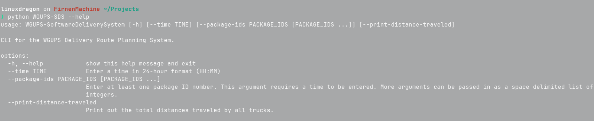
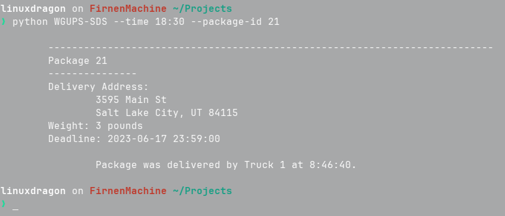
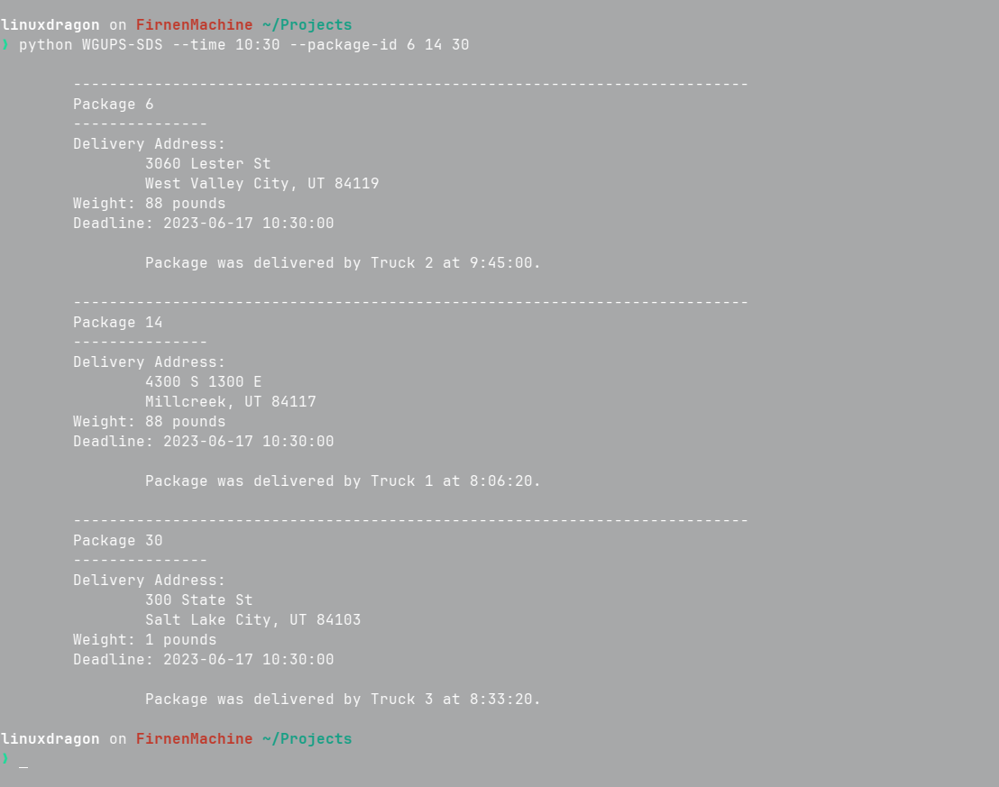
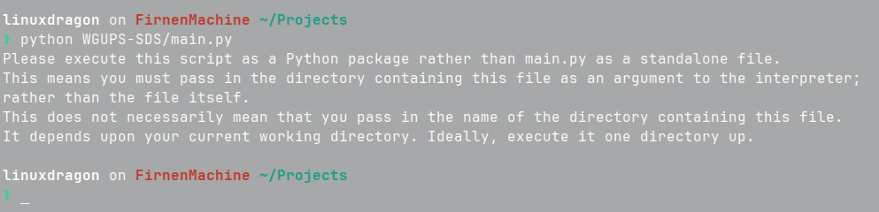

## Getting Started

In order to run this program on Linux:
`python WGUPS-SDS --help`

In order to run this program on Windows:
`python.exe WGUPS-SDS --help`

Passing in the `--help` flag will print out a list of 
optional arguments that can be passed into this script to
along with a short description on how to use the flags.

### Running the program with no Arguments

Running the program with no arguments will print all
packages out to the console along with the delivery
time.
.png)
.png)
.png)
.png)

### Passing in the `--time` Argument

If a time is entered with no other arguments, then all
packages will be printed to the console just as in the
scenario that no arguments were passed in at all, except
the delivery status of each package is printed at the
time specified rather than printing the time that they
were delivered. Enter the time in 24-hour format: `HH:MM`.
.png)
.png)
.png)
.png)

### Passing in the `--package-ids` Argument

A `--time` argument MUST be provided with this argument.
Failing to provide a time argument will cause an error.
This argument takes a list of space delimited integers
(i.e. 1 2 3 4 5) and it displays package information only
for those packages as well as the status of each package 
at the time specified.

### Passing in the `--print-distance-traveled` Argument

Regardless of other options passed in (or lack thereof),
this argument will append the total distance traveled by
each truck as well as their combined total distance to
the end of the output.
.png)
.png)

### Running the main.py File

Do not execute the main.py file. With this program,
you do not execute any file directly; rather you pass
in the project's root directory as an argument to the Python 
interpreter installed on your system. It will automatically 
execute the correct files in the correct order as needed.
